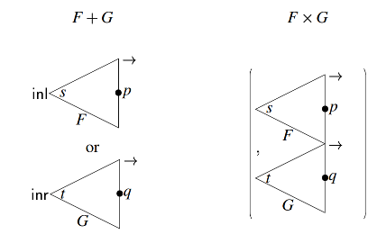

<!-- $theme: gaia
 template: gaia
 -->
<!-- $font: 10pt -->
 
# An Intellectual History of Automatic Differentiation

### Papers We Love 

#### May 24th, 2017

---
<!-- page_number: true -->

## What is Automatic Differentiation?

What it's not:
- Numeric approximation (Lagrangian interpolation, etc.)
  - _Relatively_ fast, but inexact (e.g. Runge's phenomenon).
- Symbolic integration (computer algebra systems, e.g. MATLAB, Maple, Mathematica)
  - Exact, but slow and _ugly_ ...who enjoyed high school calculus?

---

## What is Automatic Differentiation?

But what _is_ it? An example in Haskell:

```
λ> let sin' = int cos'
λ> let cos' = 1 - int sin'
λ> take 5 $ sin'
[0 % 1,1 % 1,0 % 1,(-1) % 6,0 % 1,
1 % 120,0 % 1,(-1) % 5040,0 % 1,1 % 362880]
λ> take 5 $ cos'
[1 % 1,0 % 1,(-1) % 2,0 % 1,1 % 24,
0 % 1,(-1) % 720,0 % 1,1 % 40320,0 % 1]
```

Exact _and_ fast! Plus no ugly subscripts :)

---

## Why does this even work?

> The Jargon File makes a distinction between deep magic, which refers to code based on esoteric theoretical knowledge, and black magic, which refers to code based on techniques that appear to work but which lack a theoretical explanation.

&nbsp;&nbsp;&nbsp;&nbsp;&nbsp;&nbsp;&nbsp;&nbsp; - Wikipedia

It's not a coincidence. AD is baked into the very structure of computation....

---

## The Operational Calculus

You may have seen some of these:
&nbsp;&nbsp;&nbsp;&nbsp;&nbsp;&nbsp;

Since Leibniz, mathematicians were developing notations for calculus by overloading mathematical symbols much as we do with operators in languages like C++ and Haskell. 

---

## The Operational Calculus

During the late 19th century this became known as the __operational calculus__ and was especially popular in mathematical physics:
- George Boole: _A Treatise on Differential Equations_ (1859)
- Oliver Heaviside: _On Operators in Physical Mathematics_ (1893)
- Norbert Wiener: _The Operational Calculus_ (1926)

---

## Computation

Differentiation was a motivating example for computation from the very beginning:

&nbsp;&nbsp;&nbsp;&nbsp;&nbsp;&nbsp;&nbsp;&nbsp;&nbsp;&nbsp;&nbsp;&nbsp;&nbsp;&nbsp;&nbsp;&nbsp;
In 1822, 15 years before the general purpose Analytical Engine, Charles Babbage described the __Difference Engine__ sparking interest in analogue computers for the purpose of calculating derivatives that would last well into the 20th century.

---

## Computation

</br>
</br>

However, the fact that differentiation itself could not be formalized as a mathematical function continued to plague logicians. 

</br>
</br>


Until...

---

## The Lambda Calculus

> It is, of course, not excluded that the range of arguments or range of values of a function should consist wholly or partly of functions. The derivative, as this notion appears in the elementary differential calculus, is a familiar mathematical example of a function for which both ranges consist of functions.

&nbsp;&nbsp;&nbsp;&nbsp;&nbsp;&nbsp;&nbsp;&nbsp; - Alonzo Church
&nbsp;&nbsp;&nbsp;&nbsp;&nbsp;&nbsp;&nbsp;&nbsp;&nbsp; _The Calculi of Lambda Conversion_ (1941)

---

## Imperative AD

</br>
</br>

The first literature on AD was by Robert Edwin Wengert in 1964.

_A Simple Automatic Derivative Evaluation Program_ (1964) is one of many claims to the first dissertation ever written in the field of computer science. 

---

## Imperative AD

The technique was popular in the numerical computing mainstream for some time:
- Many AD tools, particularly in Fortran and C++, are compiled by Argonne National Laboratory: http://www.autodiff.org/. 
- However AD was largely abandoned in favor of "numerical methods," particularly with the advent of GPUs for fast matrix processing.

Then functional programming took over...

---

## LISP

The first known example of AD in Lisp was published in 1970 by Fred McBride (father of Conor McBride) in  _Computer Aided Manipulation of Symbols_:

&nbsp;&nbsp;&nbsp;&nbsp;&nbsp;

---

The isomorphism of differentiation with (lazy) list processing was given by Dusko Pavlovic and Martín Escardó in _Calculus in Coinductive Form_ (1998). 

Among other examples, they give the commuting square for the infinite Taylor series we saw earlier:

&nbsp;&nbsp;&nbsp;&nbsp;&nbsp;&nbsp;&nbsp;&nbsp;&nbsp;&nbsp;&nbsp;&nbsp;&nbsp;&nbsp;&nbsp;&nbsp;&nbsp;&nbsp;&nbsp;

---

## Lazy Evaluation

</br>
AD is particularly elegantly expressed using stream processing, a concept first formalized by Peter Landin in _Correspondence Between ALGOL 60 and Church's Lambda-notation_ (1965).

This started a whole field of research into non-strict, or lazy, evaluation methods. A seminal paper that implemented a lazy version of McCarthy's Lisp interpreter was Daniel Friedman and David Wise's _CONS Should Not Evaluate Its Arguments_ (1975). 

---

## Lazy Evaluation

The Lisp community quickly abandoned lazy evaluation, but it later became popular in other functional languages: KRC, Miranda, and Haskell. 

Philip Wadler, one of the original developers of Haskell, examined lazy lists in _The Essence Of Functional Programming_ (1992):
> It is difficult to see how to make this change in an impure language. Perhaps one might create some form of coroutine facility.

With hindsight, this is not difficult to see at all...

---

## Coroutines

What came to be the standard approach to functional AD first appeared in 1977 in an unpublished paper by Gilles Kahn & David MacQueen, _Coroutines and Networks of Parallel Processes_. 

The paper focused on a a coroutine-based approach to generating prime numbers in ML using the Sieve of Eratosthenes. An AD package was only mentioned in the conclusion with no code provided.

---

# SICP

Both the prime sieve and power series programs became canonical examples of the power of lazy evaluation, likely owing to their inclusion in Gerald Sussman and Harold Abelson's _Structure and Interpretation of Computer Programs_.

Sussman would later release a more general AD implementation as part of his SCMUTILS package used in _Structure and Interpretation of Classical Mechanics_, co-written with Jack Wisdom.

---

## Unix

Kahn and MacQueen's paper also caught the eye of Doug McIlroy who had already programmed one of the earliest implementations of the prime sieve using coroutines in 1968.

McIlroy is best known for adding pipelines to Unix, which enabled the "the Unix philosophy" of composing many single-purpose programs through a common interface: text-streams.

Standard I/O is fundamentally lazy&mdash;it inputs and outputs only as much as the program needs&mdash;and some in the functional programming world have pointed out the similarity between Unix pipes and the IO monad.

---

## Concurrent AD

McIlroy would later describe his use of coroutines in terms of Tony Hoare's groundbreaking concurrency model _Communicating Sequential Processes_ (1978).

In the 1980s Bell Lab's Rob Pike developed a series of languages based on Hoare's CSP model of concurrency, leading up to Google's Go language. 

One such language, Newsqueak, provided the medium for McIlroy's first attempt at implementing Kahn and McQueen's coroutine-based AD program, which he published in the paper _Squinting at Power Series_ (1989).

---

## Concurrent AD

&nbsp;&nbsp;&nbsp;&nbsp;&nbsp;&nbsp;&nbsp;&nbsp;&nbsp;&nbsp;&nbsp;&nbsp;&nbsp;&nbsp;&nbsp;&nbsp;&nbsp;&nbsp;&nbsp;&nbsp;
McIlroy's function for the Cauchy product using recursively generated channels

---

## AD in Haskell

</br>
</br>

McIlroy later wrote a version of his power series program in Haskell, published in _Power Series, Power Serious_ (1998) and _The Music of Streams_ (2001). 

</br>

The most basic version consisted of 17 one-liners:

---

```default (Integer,Rational,Double)
infixr 9 #
series f = f : repeat 0
instance (Num a, Eq a) => Num [a] where
   fromInteger c = series(fromInteger c)
   negate (f:ft) = -f : -ft
   (f:ft) + (g:gt) = f+g : ft+gt
   (f:ft) * gs@(g:gt) = f*g : ft*gs + series(f)*gt
instance (Fractional a, Eq a) => Fractional [a] where
   (f:ft) / (g:gt) = qs 
     where qs = f/g : series(1/g)*(ft-qs*gt)
(f:ft) # gs@(0:gt) = f : gt*(ft#gs)
revert (0:ft) = rs where rs = 0 : 1/(ft#rs)
int fs = 0 : zipWith (/) fs [1..]
diff (_:ft) = zipWith (*) ft [1..]
tans = revert(int(1/(1:0:1)))
sins = int coss
coss = 1 - int sins
```

He described it as, "The most beautiful code I've ever written."

---

## "Worse is Better" Was a Lie

</br>
</br>
</br>
</br>

...and thus automatic differentiation is the missing bridge between Unix & C and Lisp & Functional Programming.

---

## Functional AD Taken Seriously

One year prior to McIlroy's "Power Serious," a researcher named Jerzy Karczmarczuk published another Haskell version using a different approach:
- Focus on finite polynomials (coining the phrase "lazy tower" for the derivatives) 
- Dual numbers (tuples of doubles) used to represent the value of a function and its derivative at a given point
- Generating new Haskell functions to calculate derivatives, allowing use of built-in functional composition

---

## Jerzy Karczmarczuk

Karczmarczuk's _Generating Power of Lazy Semantics_ (1997) became a seminal paper in the field and he went on to write numerous others:
- _Functional Coding of Differential Forms_ (1999)
- _Functional Differentiation of Computer Programs_ (2000)
- _Adjoint Codes in Functional Framework_ (2000)
- _Lazy Time Reversal, and Automatic Differentiation_ (2002)

---

## AD Modes

Forward, reverse (adjoint), or mixed mode?
- Forward
  - Application of the chain rule from left to right
  - Or inside to outside when thought of in terms of functional composition
  - i.e. the way  you learned in high school calculus
  - Generally considering the most straightforward to implement

---

## AD Modes

- Reverse mode:
  - Application of the chain rules from right to left
  - Or outside to inside in terms of functional composition
  - For this last reason, much less intuitive and more difficult to implement
  - However, extremely useful for certain applications (machine learning...)

---

## AD Modes

</br>
</br>
</br>

- Mixed mode:
  - What is sounds like: a combination of both directions

---

## AD Techniques: Data-Driven

- Either returning the value of a derivative...
- ...or the derivative itself represented as a value (as in McIlroy's Haskell version)
- Generally considered the most primitive method and only useful for power series...
- ...however, this assumes the inability to compose functions once they're output as data.
- McIlroy showed this actually _can_ be done by converting functions to Horner form

---

## AD Techniques: Functions
</br>

Using operator overloading:
- Karczmarczuk's method, also imperative implementations (i.e. FADBAD++)
- Also Conal Elliot: _Beautiful Differentiation_ (2009)
- Upside vs. data-driven approach: allows use of built-in functional composition

---

## AD Techniques: Functions

Downsides of operator overloading approach: 
- Introduces problem of confusing levels of derivatives, i.e. overloaded operators cannot be applied to derivatives at multiple levels
- Referred to as "perturbation confusion" of "confusion of infinitesimals"
- Makes reverse mode very difficult
- Current dominant Haskell package, Edward Kmett's AD library, started as a Stack Overflow answer about reverse mode in Haskell
  
---

## AD Techniques: Source Generation

Derivative functions are generated using compile-time metaprogramming:
- Solves the problems presented by operator overloading
- Used in several extremely fast Fortran packages
- DiffSharp: 
  - Source transformation using the F# quotations evaluator
  - Benefits from incremental compilation using .NET's LINQ framework
    
---

## Siskind and Pearlmutter

Jeffrey Siskand and Barak Pearlmutter: 
- By far the most prolific AD researchers. 
- Mainly working in Scheme and Haskell, but also DiffSharp and a Lisp dialect AD as primitives. 
- First to point out problems with the operator overloading approach in the classic paper _Perturbation Confusion and Referential Transparency: Correct Functional Implementation of Forward-Mode AD_ (2005)

---

## Siskind and Pearlmutter

Went on to publish numerous others including:
- _Lazy Multivariate Higher-Order Forward-Mode AD_ (2007)
- _Nesting Forward-Mode AD in a Functional Framework_ (2007)
- _Reverse-Mode AD in a Functional Framework: Lambda the Ultimate Backpropagator_ (2008)
- _Putting the Automatic Back into AD_ (2008)

---

## Derivatives of Types

Seminal paper is Conor McBride's _The Derivative of a Regular Type is its Type of One-Hole Contexts_ (2001). Already presented at Papers We Love.

> The derivative is thus the sum of terms corresponding to each one-hole context for a zipper in the expression. Perhaps the key to the connection can be found by focusing not on what is being infinitesimally varied, but on what, for the sake of a linear approximation to the curve, is being kept the same.

---

## Derivatives of Types

&nbsp;&nbsp;&nbsp;&nbsp;&nbsp;&nbsp;&nbsp;&nbsp;&nbsp;&nbsp;&nbsp;&nbsp;&nbsp;&nbsp;&nbsp;&nbsp;&nbsp;&nbsp;&nbsp;&nbsp;
Other papers on type-level derivatives:
- _∂ for Data: Differentiating Data Structures_ (2005) Conor McBride, Thorsten Altenkirch, et al
- _The Two Dualities of Computation: Negative and Fractional Types_ (2012) James & Sabry

---

## Derivatives of Types

- Requires dependent types, i.e. a specification of the relationship between the parametric types of the containers and the data they hold. 

- Interestingly, the concept of universes in type theory is isomorphic to that of the functional approach to differentiation in that operators have different meanings on different levels.

- Differential geometry is also being formalized in category theory as R-modules, which turn out to correspond to types in the simply typed version of the differential lambda calculus...

---

## Differential Lambda Calculus

Thomas Ehrhard and Laurent Regnier in the _The Differential Lambda-Calculus_ (2001)

Builds on  McBride's work, but refining the notion of "regular types" to variables in the lambda calculus using linear logic:
- Extends the Taylor formula (computing derivatives by composing Taylor series) to bound variables in lambda terms
- One can also think of the arguments to curried functions in typed lambda calculi as having a correspondence with terms in Taylor series.

---

- Partial derivatives are represented as substitutions over different bound variables.
- A _purely_ differential lambda calculus, i.e. one with only bound variables, means that all derivatives except for that of zero are partial.
- The chain rule is applied in a manner similar to encoding of Church numerals by repeated application of the successor function.
- Reduction rules for lambda calculus hold for differentiation: partials are function bodies that relate to only one argument in a multi-ariadic function. 
- The chain rule is literally just beta-reduction.

---

## Differential Lambda Calculus

</br>
</br>
</br>
</br>

In other words...the differential lambda calculus is Church's dream realized!

---

## VLAD: a purely functional language with built-in AD

Differential lambda calculus was implemented by Siskind & Pearlmutter in their Stalingrad interpreter for the Lisp dialect VLAD:
- Allows differentiation to commute as it does using symbolic methods (Schwarz lemma)
- Eliminates reflection using SSA, resulting is a 3-5x speedup vs. Fortran-based source transformation, 50x vs. C++ template-based approaches, and 250x (!) compared to the best Haskell libaries

---

## Benchmarks

Using the examples of minimax of a saddle curve and a particle simulation using Euler's equations:


&nbsp;&nbsp;&nbsp;&nbsp;&nbsp;&nbsp;&nbsp;_Efficient Implementation of a Higher-Order 
&nbsp;&nbsp;&nbsp;&nbsp;&nbsp;&nbsp;Language with Built-In AD_ (2016)

---

## The AD Renaissance: Machine Learning

Good news: AD is becoming popular again for practical use!

Why? Primarily for machine learning: backpropagation == the chain rule.
- Autograd for NumPy has been integrated with Torch
- Google's Ceres Solver (C++ numerical programming tool for ML) includes an AD option

---

## The AD Renaissance: Machine Learning

More cutting edge:
- In _Learning to Transduce with Unbounded Memory_ (2015) DeepMind demonstrated that training an LSTM using "differentiable data structures" (stacks, queues, and dequeues of matrices with AD built into them) allowed them to achieve the same results in one pass as in four using gradient descent through approximation. 
- They've since moved on to designing "differentiable neural computers."

---

## The AD Renaissance: Modelling

There's also interest in quantitative finance and other fields that require modelling stochastic processes:
- _Smoking Adjoints: Fast Monte Carlo Greeks_ (2004) Giles & Glasserman
- _Adjoints and Automatic (Algorithmic) Differentiation in Computational Finance_ (2011) Cristian Homescu
- The Stan probabilistic programming language developed at Columbia University includes an AD implementation in C++
