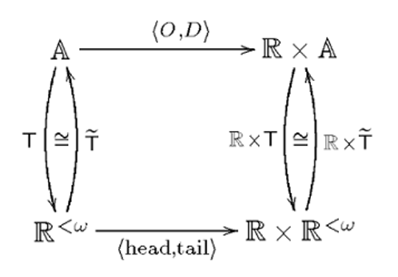

<!-- $theme: gaia
 template: gaia
 -->
 
# An Intellectual History of Automatic Differentiation

## Papers We Love 

## May 24th, 2017
---

# What is Automatic Differentiation?

What it's not:
- Numerical approximation (lagrangian interpolation, etc.)
  - _Relatively_ fast, but inexact (e.g. Runge's phenomenon).
- Symbolic integration (computer algebra systems, e.g. MATLAB)
  - Exact, but slow and _ugly_ ...who enjoyed high school calculus?

---

# What is Automatic Differentiation?

But what is _it?_

An example in Haskell:

```λ> let sin' = int cos'
λ> let cos' = 1 - int sin'
λ> take 10 $ sin'
[0 % 1,1 % 1,0 % 1,(-1) % 6,0 % 1,1 % 120,0 % 1,(-1) % 5040,0 % 1,1 % 362880]
λ> take 10 $ cos'
[1 % 1,0 % 1,(-1) % 2,0 % 1,1 % 24,0 % 1,(-1) % 720,0 % 1,1 % 40320,0 % 1]
```
The first ten terms for the Taylor series of sine and cosine.

Exact _and_ fast! Plus no ugly subscripts :)

---

# Why does this even work?

> "The Jargon File makes a distinction between deep magic, which refers to code based on esoteric theoretical knowledge, and black magic, which refers to code based on techniques that appear to work but which lack a theoretical explanation."

&nbsp;&nbsp;&nbsp;&nbsp;&nbsp;&nbsp;&nbsp;&nbsp; - Wikipedia

It's not a coincidence. As implied by the phrasing "automatic," AD is baked into the very structure of computation.

If fact, to some degree it motivated the invention of computers and the field of computer science...

---

# The Operational Calculus

You may have seen some of these:


Since Leibniz, mathematicians were developing notations for calculus using operators by overloading mathematical symbols much as we do with operators in C++ and Haskell, for example in the Power Serious example we just saw. 

---

# The Operational Calculus

During the late 19th century and early 20th centuries this became known as the __operational calculus__ and was especially popular in mathematical physics:
- George Boole: _A Treatise on Differential Equations_ (1859)
- Oliver Heaviside: _On Operators in Physical Mathematics_ (1893)
- Norbert Wiener: _The Operational Calculus_ (1926)

Specific cases of the operational calculus were later formalized in abstract algebra as the __Weyl algebra__ and __D-modules__.

---

# Computation

Differentiation was a motivating example for computation from the very beginning


In 1822, 15 years before he introduced his general purpose Analytical Engine, Charles Babbage described the __Difference Engine__ ...sparking interest in analogue computers for the purpose of calculating derivatives that would last well into the 20th century. 

---

# Computation

However, the fact that differentiation itself could not be formalized as a mathematical function continued to plague logicians. 

Until...

---

# The Lambda Calculus

> "It is, of course, not excluded that the range of arguments or range of values of a function should consist wholly or partly of functions. The derivative, as this notion appears in the elementary differential calculus, is a familiar mathematical example of a function for which both ranges consist of functions."

&nbsp;&nbsp;&nbsp;&nbsp;&nbsp;&nbsp;&nbsp;&nbsp; Alonzo Church, _The Calculi of Lambda Conversion_ (1941)

---

# Imperative AD

The first literature on AD was by Robert Edwin Wengert in _A Simple Automatic Derivative Evaluation Program_ (1964), one of many claims to the first dissertation ever written in the field of computer science. 

The technique was popular in the numerical computing mainstream for some time:
- Many AD tools, particularly in Fortran and C++, are compiled by Argonne National Laboratory: http://www.autodiff.org/. 
- However AD was largely abandoned in favor of "numerical methods," particularly with the advent of GPUs for fast matrix processing.

Then functional programming took over...

---

# LISP

In 1958 John McCarthy based LISP on Church's untyped lambda caclulus.

The first known example of AD in Lisp was published in 1970 by Fred McBride (father of Conor McBride) in his dissertation _Computer Aided Manipulation of Symbols_, as an example of a dialect that added pattern matching:


---

# LISP

The isomorphism of differentiation with (lazy) list processing was given by Dusko Pavlovic and Martín Escardó in _Calculus in Coinductive Form_ (1998). Among other examples, they give the commuting square for the infinite Taylor series we saw earlier:



Deep magic explained!

---

# Lazy Evaluation

AD is particularly elegantly expressed using stream processing, a concept first formalized by Peter Landin in _Correspondence Between ALGOL 60 and Church's Lambda-notation_ (1965). One of his motivations was to develop an operational semantics of a language that included if-then-else statements (first introduced by McCarthy in LISP) since unlike almost any other language constructs at the time it allowed control over whether an expression was even evaluated.

This started a whole field of research into non-strict, or lazy, evaluation methods. A seminal paper that both implemented a lazy version of McCarthy's Lisp interpreter and proved it was no less efficient than the original was Daniel Friedman and David Wise's _CONS Should Not Evaluate Its Arguments_ (1975). The following decade saw increased interest into lazy Lisps, including the first implementation of Scheme and Peter Henderson's Lispkit&mdash; a purely functional Lisp that ran on Landin's SECD virtual machine.

---

# Lazy Evaluation

The Lisp community quickly abandoned lazy evaluation, but it later became popular in other functional languages: KRC, Miranda, and Haskell. 

Philip Wadler, one of the original developers of Haskell, examined lazy lists in _The Essence Of Functional Programming_ (1992):
> "It is difficult to see how to make this change in an impure language. Perhaps one might create some form of coroutine facility."

With hindsight, this is not difficult to see at all...

---

# Coroutines

What came to be the standard approach to AD first appeared in an unpublished paper by Gilles Kahn & David MacQueen, _Coroutines and Networks of Parallel Processes_, in 1977 and quickly spread throughout the functional programming world. 

The paper focused on a a coroutine-based approach to generating prime numbers (commonly referred to as the Sieve of Eratosthenes, despite controversy over whether most implementations are faithful to that originally used in 3rd century BC Egypt). A comprehensive AD package was only mentioned in the conclusion with no code provided. 

Both the prime sieve and power series programs became canonical examples of the power of lazy evaluation, likely owing to their inclusion in Gerald Sussman and Harold Abelson's _Structure and Interpretation of Computer Programs_ (Sussman would later release a more general AD implementation as part of his SCMUTILS packaged used in _Structure and Interpretation of Classical Mechanics_, co-written with Jack Wisdom).

---

# Unix

Kahn and MacQueen's paper also caught the eye of Doug McIlroy, who at the time oversaw the Computing Techniques Research Department at Bell Labs that birthed both Unix and C. McIlroy himself had already programmed one of the earliest implementations of the prime sieve using coroutines in 1968.

McIlroy is best known for adding pipelines to Unix, which enabled the "the Unix philosophy" of composing many single-purpose programs through a common interface: text-streams. Standard I/O is fundamentally lazy&mdash;it inputs and outputs only as much as the program needs (Microsoft famously broke this in DOS)&mdash; and many in the functional programming world, including McIlroy himself, have pointed out the similarity between Unix pipes and lazy lists. Oleg Kiselyov went as far as to demonstrate that pipes are an example of the IO monad.

---

# Concurrency

Around the time he wrote the prime sieve program, McIlroy visited Oxford. It's thus no surprise he would later describe his use of coroutines in terms of Sir Tony Hoare's groundbreaking concurrency model _Communicating Sequential Processes_ (1978).

In the 1980s Bell Lab's Rob Pike developed a series of languages based on Hoare's CSP model of concurrency, leading up to Google's Go language. One of these was based on the Squeak dialect of Smalltalk and therefore called Newsqueak, which provided the medium for McIlroy's first attempt at implementing Kahn and McQueen's elusive coroutine-based AD program, which he published in the paper _Squinting at Power Series_ (1989).


McIlroy's function computing the Cauchy product using recursively generated channels

---

# AD in Haskell

McIlroy later wrote a version of his power series program in Haskell, published in _Power Series, Power Serious_ (1998) and _The Music of Streams_ (2001). The most basic version of the code consisted of 17 one-liners:

```default (Integer,Rational,Double)
infixr 9 #
series f = f : repeat 0
instance (Num a, Eq a) => Num [a] where
   fromInteger c = series(fromInteger c)
   negate (f:ft) = -f : -ft
   (f:ft) + (g:gt) = f+g : ft+gt
   (f:ft) * gs@(g:gt) = f*g : ft*gs + series(f)*gt
instance (Fractional a, Eq a) => Fractional [a] where
   (f:ft) / (g:gt) = qs where qs = f/g : series(1/g)*(ft-qs*gt)
(f:ft) # gs@(0:gt) = f : gt*(ft#gs)
revert (0:ft) = rs where rs = 0 : 1/(ft#rs)
int fs = 0 : zipWith (/) fs [1..]
diff (_:ft) = zipWith (*) ft [1..]
tans = revert(int(1/(1:0:1)))
sins = int coss
coss = 1 - int sins
```

McIlroy described it as, "The most beautiful code I've ever written."

---

# "Worse is Better" Was a Lie

...and thus AD is the missing bridge between Unix/C and Lisp/Functional Programming.

---

# Functional AD Taken Seriously

One year prior to McIlroy's "Power Serious," a researcher named Jerzy Karczmarczuk published another Haskell version that took a slightly different approach:
- The power series approach applied to finite polynomials (here called a "lazy tower" of derivatives) 
- Dual numbers (tuples of doubles) used to represent the value of a function and its derivative at only a given point
- Generating new Haskell functions to calculate derivatives, which allowed use of built-in functional composition

Karczmarczuk's _Generating Power of Lazy Semantics_ (1997) became a seminal paper in the field and he went on to write numerous others exploring topics such as multivariate functions and the reverse (or adjoint) mode:
- _Functional Coding of Differential Forms_ (1999)
- _Functional Differentiation of Computer Programs_ (2000)
- _Adjoint Codes in Functional Framework_ (2000)
- _Lazy Time Reversal, and Automatic Differentiation_ (2002)

---

# Modern AD Research: Modes

Forward mode, reverse (adjoint) mode, or mixed mode?
- Forward
  - Application of the chain rule goes to left to right
  - Or inside to outside when thought of in terms of functional composition
  - In other words, what you learned in high school calculus
  - Generally considering the most straightforward to implement
- Reverse mode:
  - Application of the chain rules goes right to left
  - Or outside to inside in terms of functional composition
  - For this last reasong, obviously much less intuitive and more difficult to implement
  - However, extremely useful for certain applications (machine learning...)
- Mixed mode:
  - What is sounds like: a combination of both directions

---

# Modern AD Research: Techniques

Derivatives as data
- Either returning the value of a derivative...
- Or the derivative itself represented as a value (as we saw with McIlroy's Haskell version)
- Generally considered the most primitive method and only useful for power series...
- ...however, this assumes the inability to compose functions once they're output as data.
- McIlroy shows us this can be done by converting functions to Horner Form ("Horner's rule" in American English)

---

# Modern AD Research: Techniques

Derivatives as functions through operator overloading
- Jerzy Karczmarczuk's method, also imperative implementations (i.e. FADBAD++)
- Later implemented by Jerry Sussman in Scheme
- Also Conal Elliot in Haskell: _Beautiful Differentiation_ (2009)
- Upside vs. data-driven approach: allows use of built-in functional composition
- Downside: introduces problem of confusing levels of derivatives
  - Even overloaded arithmetic operators cannot be applied to derivatives at multiple levels. They mean different things!
  - Referred to as "perturbation confusion" of "confusion of infinitesimals" (more on this in a second...)
  - Make reverse mode very difficult, lots of "lifting" in Haskell
  - Current dominant Haskell package, Edward Kmett's AD library, started as a response to a Stack Overflow question about reverse mode in Haskell
  
---

# Modern AD Research: Techniques

Metaprogramming
  - Generating derivative functions at compile time solves the problems presented by operator overloading
  - Used in several extremely fast Fortran packages
  - DiffSharp: 
    - Source transformation using the F# quotations evaluator
    - Benefits from incremental compilation using .NET's LINQ framework
    
---

# Siskind and Pearlmutter

Most prolific AD researchers by far. 

Siskind teaches at Purdue. Pearlmutter currently runs the Brain and Computation Lab at the National University of Ireland Maynooth.

Mainly working in Scheme and Haskell, but also developed DiffSharp and a dialect of Lisp with AD as primitives. 

First to point out problems with the operator overloading approach in the classic paper _Perturbation Confusion and Referential Transparency: Correct Functional Implementation of Forward-Mode AD_ (2005).

Went on to publish numerous others. A small sample:
- _Lazy Multivariate Higher-Order Forward-Mode AD_ (2007)
- _Nesting Forward-Mode AD in a Functional Framework_ (2007)
- _Reverse-Mode AD in a Functional Framework: Lambda the Ultimate Backpropagator_ (2008)
- _Efficient Implementation of a Higher-Order Language with Built-In AD_ (2016) 

---

# Derivatives of Types

Seminal paper is Conor McBride's _The Derivative of a Regular Type is its Type of One-Hole Contexts_ (2001). 

Already presented at Papers We Love (watch it on YouTube).

> "One observation does, however, seem relevant: the syntactic operation of differentiating an expression with respect to zippers generates an approximation to the change in value of that expression by summing the contributions generated by varying each of the zipper’s in the expression in turn. The derivative is thus the sum of terms corresponding to each one-hole context for a zipper in the expression. Perhaps the key to the connection can be found by focusing not on what is being infinitesimally varied, but on what, for the sake of a linear approximation to the curve, is being kept the same."

...which makes sense since AD is largely distinguished by exact calculation defined without deference to theoretical variance: ie. infinitesimals, perturbation, etc.

---

# Derivatives of Types


Other papers on type-level derivatives:
- _∂ for Data: Differentiating Data Structures_ (2005) McBride, Thorsten Altenkirch (co-author of the HoTT book), et al
- _The Two Dualities of Computation: Negative and Fractional Types_ (2012) Roshan James & Amr Sabry

To specify the _type_ of containers for data as having structure that is inherently differentiable requires dependent types, i.e. a specification of the relationship between the parametric types of the containers and the data they hold. Interestingly, the concept of universes in dependent type theory is isomorphic to that of the functional approach to differentiation in that operators have different meanings on different levels.

Differential geometry is also being formalized in category theory as R-modules, which turn out to correspond to types in the simply typed version of the differential lambda calculus...

---

# Differential Lambda Calculus

Thomas Ehrhard and Laurent Regnier in the _The Differential Lambda-Calculus_ (2001)

---

# VLAD: a purely-functional language with built-in AD operators


---

# The AD Renaissance

---
